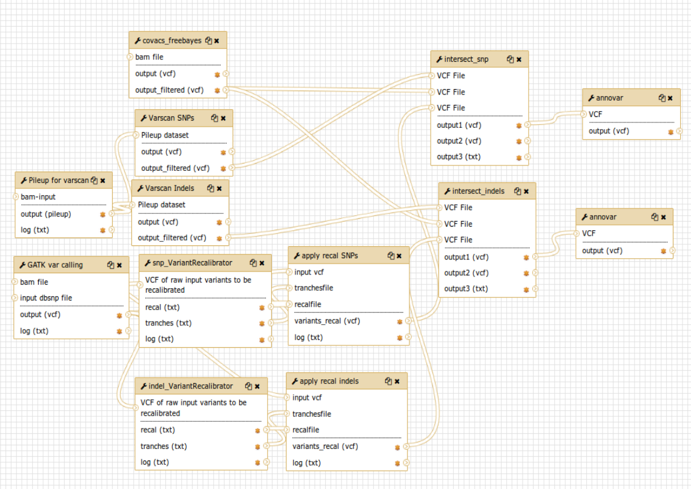
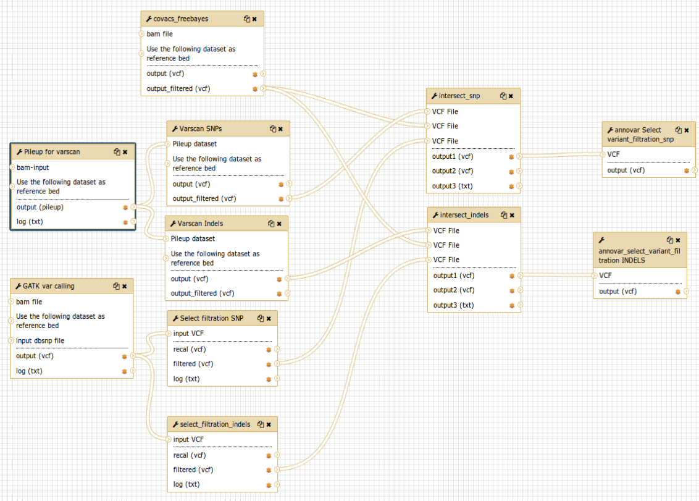

CoVaCS flavor Laniakea-documentation
====================================

Pipeline description
####################
CoVaCS (Chiara et al. 2018), Consensus Variant Calling System, is a fully automated system for genotyping and variant annotation of resequencing data produced by second generation NGS technologies.
The CoVaCS pipeline integrates cutting-edge tools for variant calling and annotation for whole genome sequencing (WGS), whole-exome sequencing (WES) and target-gene sequencing (TGS) data.

Implementation on Galaxy
########################
The implementation of CoVaCS on Galaxy perform the following pipeline steps:

   1. Quality control
   2. Quality Trimming
   3. Mapping
   4. Variant calling
   5. Variant selection
   6. Variant annotation

Every step of the pipeline is performed by one or more bioinformatics tools:

  1. Quality control of raw reads is performed by FastQC.This software provides quality control report on raw sequence data spotting problems which originate either in the sequencer or in the starting library material.The report gives a quick impression of the quality of raw data, making the user aware of any quality problems before making any further analysis. `wrapper FastQC <https://toolshed.g2.bx.psu.edu/repository?repository_id=ca249a25748b71a3>`_ 

  2. Quality trimming step is performed by Trimmomatic. Taking into account the data problems encountered in the previous step, Trimmomatic offer the possibility to optimize the raw reads length. It includes several options for read trimming and filtering. `wrapper Trimmomatic <https://toolshed.g2.bx.psu.edu/repository?repository_id=ef9e620e9ac844b3>`_
       
  3. The mapping step is performed by the Burrows-Wheeler Aligner (BWA) software package for mapping sequences against a large reference genome.It uses a Burrow's Wheeler Transform method to map the reads on the reference genome creating a Sequence/Alignment Map (SAM) file for each sample. `wrapper BWA <https://toolshed.g2.bx.psu.edu/repository?repository_id=9ff2d127cd7ed6bc>`_
       
  4. The variant calling step is performed by three different tools:

        -  Varscan2, which adopts a series of stringent quality metrics in order to identify putative false positive predictions. `wrapper Varscan2 <https://testtoolshed.g2.bx.psu.edu/view/elixir-it/covacs_varscan2/44e9fd8fd25a>`_.
        -  GATK, which performs local reassembly of the reads to mitigate sequence errors and reconstruct haplotypes using VariantRecalibrator and ApplyRecalibrator for standard CoVaCS implementation and Select filtration wrapper in case of in case of not enough snp or indels error in covacs_VariantRecalibrator. `wrapper VariantRecalibrator <https://testtoolshed.g2.bx.psu.edu/view/elixir-it/covacs_variant_recalibrator/18481dd04f37>`_ `wrapper ApplyRecalibrator <https://testtoolshed.g2.bx.psu.edu/view/elixir-it/covacs_apply_recalibrator/48dc4c9bc497>`_ `wrapper SelectFiltration <https://testtoolshed.g2.bx.psu.edu/view/elixir-it/covacs_select_filtration/3a37867409fe>`_ 
        -  Freebayes (Garrison and Marth 2012) which is based on a probabilistic haplotype reconstruction algorithm. `wrapper Freebayes <https://testtoolshed.g2.bx.psu.edu/view/elixir-it/covacs_freebayes/cbe203c9bc3a>`_ 

   Each tool gives two different output one for the discovery of Indels and one for SNPs.

  5. All the SNPs discovered by the different approaches of the previous point, are grouped into two separate outputs by a two perl script intersect_snp and intersect_indels: common SNPs (SNPs detected by two or three tools) and unique SNPs (SNPs discovered by only one tool). The same process is applied to Indels generating common Indels and unique Indels files. `wrapper covacs intersect SNP <https://testtoolshed.g2.bx.psu.edu/view/elixir-it/covacs_intersect_snps/3edc7bb490d3>`_ `wrapper covacs intersect indels <https://testtoolshed.g2.bx.psu.edu/view/elixir-it/covacs_intersect_indels/482e911975a1>`_
       
  6. The variant annotation step, both of common and unique variants, is performed by Annovar (Wang, Li, and Hakonarson 2010). Annovar functionally annotates enetic variants returning:

        * Gene-based annotation: identify whether SNPs or CNVs cause protein-coding changes and the amino acids that are affected
        * Region-based annotation: identify variants in specific genomic regions.
        * Filter-based annotation: identify variants that are documented in specific databases.

     `wrapper annovar <https://testtoolshed.g2.bx.psu.edu/view/elixir-it/covacs_annovar/40db0c5e3310>`_ The output comprising the annotated variants can be uploaded and visualized for example on the `UCSC genome browser <https://genome.ucsc.edu/>`_.

CoVaCS reference data
#####################

Reference present on elixir-italy.covacs.refdata
Reference Genome indexed for BWA and GATK downloaded from GATK bundle ucsc.hg19.fasta

Annovar Databases

For Gene-based annotation:

* refGene

Filter-based annotation:

.. hlist::
   :columns: 2
   
   * Exac03
   * 1000g2015aug
   * avsnp150
   * clinvar_20180603
   * cosmic70
   * dbnsfp33a
   * esp6500_all
   * kaviar_2015092361
   * knownGene
   * mitimpact2
   * gnomad_genome

Downloaded from Annovar repository using the command

.. code:: bash

 ~$perl annotate_variation.pl -downdb -buildver hg19 -webfrom annovar <database_name> humandb

CoVaCS Galaxy workflows
#######################

The first workflow was implemented to run the standard pipeline of CoVaCS (fig.1) starting after the quality control, trimming and mapping.

.. centered:: fig.1  CoVaCS standard workflow screenshot

The second workflow (fig.2) differs from the previous one since the GATK
VariantRecalibrator and ApplyRecalibrator are replaced by the Select filtration wrapper
This workflow has been developed in order to be used by users in case of in case of not enough snp or indels error in VariantRecalibrator.

.. centered:: fig.2 CoVaCS Select Filtration workflow screenshot
