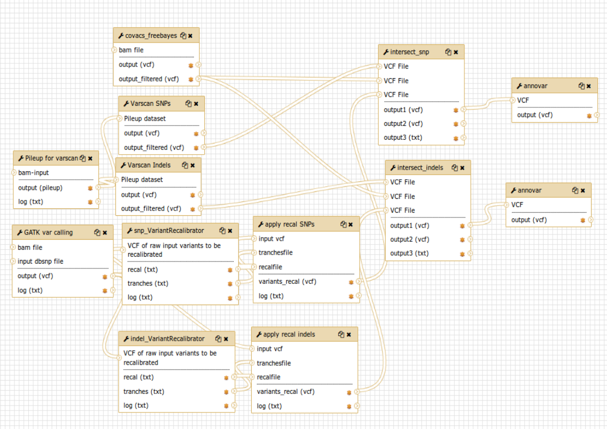
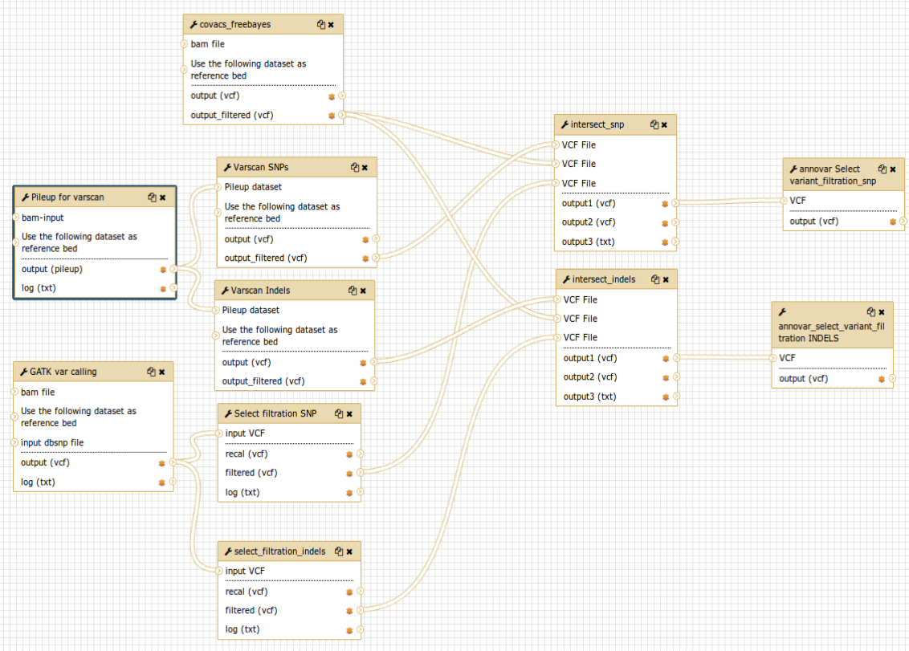

CoVaCS on Galaxy
================

`CoVaCS <https://www.ncbi.nlm.nih.gov/pubmed/29402227>`_, Consensus Variant Calling System, is a fully automated system for genotyping and variant annotation of resequencing data produced by second generation NGS technologies. The CoVaCS pipeline integrates cutting-edge tools for variant calling and annotation for whole genome sequencing (WGS), whole-exome sequencing (WES) and target-gene sequencing (TGS) data.

The implementation of CoVaCS on Galaxy performs the following pipeline steps:

#. Quality control

#. Quality Trimming

#. Mapping

#. Variant calling

#. Variant selection

#. Variant annotation

Each step of the pipeline is performed by one or more bioinformatics tools:

-------------------
``Quality control``
-------------------

The quality control of raw reads is performed by FastQC.

:Description:
	This step provides quality control report on raw sequence data spotting problems which originate either in the sequencer or in the starting library material. The report gives a quick view of the quality of raw data, making the user aware of any quality problems before making any further analysis

:Galaxy wrapper: `wrapper FastQC <https://toolshed.g2.bx.psu.edu/repository?repository_id=ca249a25748b71a3>`_

--------------------
``Quality Trimming``
--------------------

The quality trimming step is performed by Trimmomatic

:Description:
	Taking into account the data problems found in the previous step, Trimmomatic provides the possibility to optimize the raw reads length. It includes several options to read trimming and filtering.

:Galaxy wrapper: `wrapper Trimmomatic <https://toolshed.g2.bx.psu.edu/repository?repository_id=ef9e620e9ac844b3>`_

-----------
``Mapping``
-----------

The mapping step is performed by the Burrows-Wheeler Aligner (BWA) software package for mapping sequences against a large reference genome.

:Description:
	It uses a Burrow's Wheeler Transform method to map the reads on the reference genome creating a Sequence/Alignment Map (SAM) file for each sample.

:Galaxy wrapper: `wrapper BWA <https://toolshed.g2.bx.psu.edu/repository?repository_id=9ff2d127cd7ed6bc>`_

-------------------
``Variant calling``
-------------------

The variant calling step is performed by three different tools: Varsca2, GATK and Freebayes. Each tool gives two different output one for the discovery of Indels and one for SNPs.

************
``Varscan2``
************

:Description:
	Varscan2 adopts a series of stringent quality metrics in order to identify putative false positive predictions.

:Galaxy wrapper: `wrapper Varscan2 <https://testtoolshed.g2.bx.psu.edu/view/elixir-it/covacs_varscan2/44e9fd8fd25a>`_ 

********
``GATK``
********

:Description:
	GATK performs local reassembly of the reads to mitigate sequence errors and reconstruct haplotypes using VariantRecalibrator and ApplyRecalibrator for standard CoVaCS implementation and Select filtration wrapper in case of not enough snp or indels error in covacs_VariantRecalibrator. 

:Galaxy wrapper: `wrapper VariantRecalibrator <https://testtoolshed.g2.bx.psu.edu/view/elixir-it/covacs_variant_recalibrator/18481dd04f37>`_ | `wrapper ApplyRecalibrator <https://testtoolshed.g2.bx.psu.edu/view/elixir-it/covacs_apply_recalibrator/48dc4c9bc497>`_ | `wrapper SelectFiltration <https://testtoolshed.g2.bx.psu.edu/view/elixir-it/covacs_select_filtration/3a37867409fe>`_

*************
``Freebayes``
*************

:Description:
	Freebayes (Garrison and Marth 2012) is based on a probabilistic haplotype reconstruction algorithm. 

:Galaxy wrapper: `wrapper Freebayes <https://testtoolshed.g2.bx.psu.edu/view/elixir-it/covacs_freebayes/cbe203c9bc3a>`_ 

---------------------
``Variant selection``
---------------------

:Description:
	All the SNPs discovered using these two approaches, are grouped into two separate outputs using two perl script ``intersect_snp`` and ``intersect_indels``: common SNPs (SNPs detected by two or three tools) and unique SNPs (SNPs discovered by only one tool). The same process is applied to Indels generating common Indels and unique Indels files.

:Galaxy wrapper: `wrapper covacs intersect SNP <https://testtoolshed.g2.bx.psu.edu/view/elixir-it/covacs_intersect_snps/3edc7bb490d3>`_ | `wrapper covacs intersect indels <https://testtoolshed.g2.bx.psu.edu/view/elixir-it/covacs_intersect_indels/482e911975a1>`_

----------------------
``Variant annotation``
----------------------

:Description:
	The variant annotation step, both of common and unique variants, is performed by Annovar (Wang, Li, and Hakonarson 2010). Annovar annotates genetic variants returning:

	- Gene-based annotation: identify whether SNPs or CNVs cause protein-coding changes and the amino acids that are affected.
	- Region-based annotation: identify variants in specific genomic regions.
	- Filter-based annotation: identify variants that are documented in specific databases.

:Galaxy wrapper: `wrapper annovar <https://testtoolshed.g2.bx.psu.edu/view/elixir-it/covacs_annovar/40db0c5e3310>`_

The output comprising the annotated variants can be uploaded and visualized for example on the `UCSC genome browser <https://genome.ucsc.edu/>`_.

---------------------

CoVaCS reference data
=====================

CoVaCS reference data are automatically mounted on Galaxy, selecting **ELIXIR-IT Galaxy CoVaCS reference data CVMFS repository** during the Instance configuration.

The available reference data are:

#. Reference Genome indexed for BWA and GATK downloaded from GATK bundle ucsc.hg19.fasta

#. Annovar Databases

   Gene-based annotation:

   - refGene

   Filter-based annotation:

   - Exac03
   - 1000g2015aug
   - avsnp150
   - clinvar_20180603
   - cosmic70
   - dbnsfp33a
   - esp6500_all
   - kaviar_2015092361
   - knownGene
   - mitimpact2
   - gnomad_genome

Downloaded from Annovar repository following the `guide <http://annovar.openbioinformatics.org/en/latest/user-guide/download/>`_ and launching the command:

::

  $ perl annotate_variation.pl -downdb -buildver hg19 -webfrom annovar <database_name> humandb

---------------------

CoVaCS workflows
================

The first workflow was implemented to run the standard pipeline of CoVaCS (fig.1) starting after the quality control, trimming and mapping.

   Fig.1 -  CoVaCS standard workflow

The second workflow (fig.2) differs from the previous one since the GATK VariantRecalibrator and ApplyRecalibrator are replaced by the Select filtration wrapper. This workflow has been developed in order to be used by users if enough snp or indels error in VariantRecalibrator.

   Fig.2 - CoVaCS Select Filtration workflow

