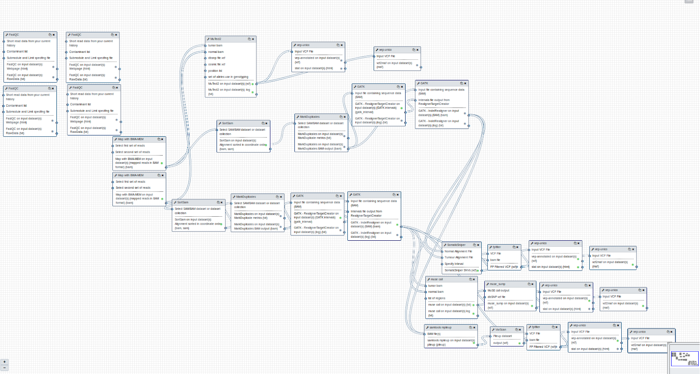

GDC Somatic Variant on Galaxy
=============================

The `GDC Somatic Variant <https://gdc.cancer.gov/node/246>`_ pipeline aims to identify and annotate somatic variants using high-throughput genomic sequencing data.

The implementation on Galaxy performs the following pipeline steps:

#. Quality check and trimming

#. Genome Alignment

#. Alignment Co-Cleaning

#. Somatic Variant Calling

#. Variant Annotation

The different steps are performed as follows.

------------------------------
``Quality check and trimming``
------------------------------

:Description:
	The *Quality check* of raw reads is performed by FastQC. It provides quality control report on raw sequence data spotting problems which originate either in the sequencer or in the starting library material. The report gives a quick outlook on the quality of raw data, making the user aware of any quality problems before making any further analysis. 

	The *Quality trimming* step is performed by Trimmomatic. This tool taking into account the data problems encountered in the previous step, offer the possibility to optimize the raw reads length. It includes several options for read trimming and filtering. 

:Galaxy wrapper: `Wrapper FastQC <https://toolshed.g2.bx.psu.edu/repository?repository_id=ca249a25748b71a3>`_ | `Wrapper Trimmomatic <https://toolshed.g2.bx.psu.edu/repository?repository_id=ef9e620e9ac844b3>`_

--------------------
``Genome Alignment``
--------------------

The *Genome Alignment* step is performed by the Burrows-Wheeler Aligner (BWA) software package for mapping sequences against a large reference genome.

:Descriptiom:
	It uses a Burrow's Wheeler Transform method to map the reads on the reference genome creating a Sequence/Alignment Map (SAM) file for each sample. After the mapping, the output file is passed to Markduplicates. This tool is used to locate and tags duplicate reads within a BAM file.

:Galaxy wrapper: `Wrapper BWA <https://toolshed.g2.bx.psu.edu/view/devteam/bwa/01ac0a5fedc3>`_ | `Wrapper MarkDuplicates <https://toolshed.g2.bx.psu.edu/repository?repository_id=c45d6c51a4fcfc6c>`_

-------------------------
``Alignment Co-Cleaning``
-------------------------

The *Co-cleaning step* is performed by GATK (Aaron McKenna, et al). 

:Description:
	Local realignment of insertions and deletions is performed using GATK IndelRealigner. This step locates regions that contain misalignments across BAM files, often caused by insertion-deletion (indel). Misalignment of indel mutations can often be scored as substitutions reducing the accuracy of the downstream variant calling steps. The second step consists of a base quality score recalibration performed by GATK BaseRecalibrator. This step allows to obtain more accurate base qualitie through the use of a machine learning algorithm that adjusts the technical errors leading to over- or under-estimated base quality scores in the data.

:Galaxy wrapper: `GATK Wrapper <https://toolshed.g2.bx.psu.edu/view/avowinkel/gatk/b80ff7f43ad1>`_

---------------------------
``Somatic Variant Calling``
---------------------------

The *somatic variant calling* step is performed using four different tools: MuSE, MuTect2, VarScan2 and SomaticSniper.

********
``MuSE``
********

:Description:
	Variant calling is performed using two tools. The **MuSE call** tool takes as input the BAM file of the normal and the tumor sample and calculates the equilibrium frequencies for all four alleles. The output is then processed by the second step, **MuSE sump**, that computes tier-based cut-offs from a sample-specific error model. The final output of the second step is a Variant Call Format (VCF) file that lists the identified somatic variants.

:Galaxy wrapper: `Muse Wrapper <https://testtoolshed.g2.bx.psu.edu/view/elixir-it/muse/110b3018eb2a>`

***********
``MuTect2``
***********

:Description:
	The tool processes the raw BAM alignment file from the mapper tool performing the detection of somatic genome variants using a Bayesian classifier, a probabilistic classifier based on the Bayes theorem. Like the other tools mentioned above, it produces in output a VCF file with the identified the variants.

:Galaxy wrapper: `Mutect2 Wrapper <https://testtoolshed.g2.bx.psu.edu/view/elixir-it/mutect2/e3662508ee26>`_

************
``Varscan2``
************

:Descritpion:
     This step is performed by two tools: Samtools Mpileup (Li et al. 2009) and VarScan2. Samtools Mpileup, takes in input the tumoral and normal bam files, provides a summary of the coverage of mapped reads on a reference sequence at single base pair resolution, in a pileup file. This file is then processed by Varscan2 that calls the somatic variants (SNPs and indels) using a heuristic method and a statistical test based on the number of aligned reads supporting each allele.

:Galaxy wrapper: `Wrapper Varscan2 <https://toolshed.g2.bx.psu.edu/view/devteam/varscan_version_2/bc1e0cd41241>`_ | `Wrapper Mpileup <https://toolshed.g2.bx.psu.edu/view/devteam/samtools_mpileup/fa7ad9b89f4a>`_
        

******************
``Somatic Sniper``
******************

:Descritpion:
	Somatic Sniper takes as input the BAM files, and determines the differences and calls the variants. In order to compare the two BAM files it employs the genotype likelihood model of MAQ (as implemented in Samtools) and then calculates the probability that the tumor and normal genotypes are different.

:Galaxy wrapper: `Wrapper Somatic Sniper <https://testtoolshed.g2.bx.psu.edu/view/elixir-it/somaticsniper/f7d69881bdec>`_

Somatic Sniper and Varscan 2 use also fpfilter to filter again the vcf. ( `Wrapper fpfilter <https://testtoolshed.g2.bx.psu.edu/view/elixir-it/fpfilter/0f17ca98338e>`_ )

----------------------
``Variant Annotation``
----------------------

:Descritpion:
	The *Variant annotation* step is performed for each of the variant calling step. The software used is the Variant Effect Predictor (VEP) (McLaren et al. 2016), made available by Ensembl. VEP takes a VCF in input and reports the genes and transcripts affected by the variants, the location of the variants, the consequences of the variant on the protein sequence, and any variant already catalogued in the database of the 1000 Genome project.

:Galaxy wrapper: `Wrapper Variant Annotation <https://testtoolshed.g2.bx.psu.edu/view/elixir-it/vep86_vcf2maf/ca1e48c52db9>`_

---------------------

GDC Somatic Variant reference data
==================================

--------------------------------
``CVMFS data.galaxyproject.org``
--------------------------------

- Reference genome Human (Homo sapiens)(b73): hg_g1k_v37
- As vcf the user have to download one of the variant ``.vcf`` files related to the b73 genome present in the ftp of `GATK bundle <https://software.broadinstitute.org/gatk/download/bundle>`_ and upload it on the Galaxy history.

-------------------------------------
``CVMFS elixir-italy.galaxy.refdata``
-------------------------------------

- Reference genome hg19_bundle (Reference Genome indexed for BWA and GATK downloaded from `GATK bundle <https://software.broadinstitute.org/gatk/download/bundle>`_ ucsc.hg19.fasta)
- As vcf the user have to download one of the variant ``.vcf`` files related to the hg19 genome present in the ftp of `GATK bundle <https://software.broadinstitute.org/gatk/download/bundle>`_ and upload it on the Galaxy history

---------------------

GDC somatic variant Galaxy workflow
===================================

.. centered:: The Galaxy workflow that connects together all the tool of the GDC-DNA-seq pipeline in order to be automatically performed in a single step.
